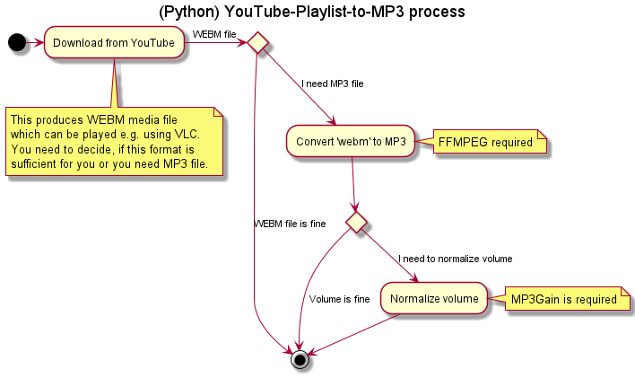

# (Python) YouTube Playlist To MP3

## Description

This repository contains a simple script(s) to download YouTube playlist
(represented as URL) into a set of `*.webm` files, which can be later converted
into the `*.mp3` audio files and their volume can be adjusted. The script stores the processed playlist items, so 
they are skipped next time the script is executed.

The script supports only audio stream downloading. However, feel free to adjust 
the code for the video support.

The conversion to `*.mp3` needs an instalation of FFMPEG to be available on 
the target computer. To adjust `.mp3` volume, MP3_GAIN must be available on the target computer (Windows OS only).

### Main features:
* Analyse tracks in the YouTube playlist
* From every track, download the best audio (highest bit-rate) stream to local drive as `*.webm` file
* Skips missing/failed tracks
* (Optionally) Skips tracks downloaded in previous execution(s)
* (Optionally) Convert tracks from `*.webm` to `*.mp3` format
* (Optionally, Windows OS only) Adjusts mp3 volume



## History

| Date       | Note                                                                                             |
|------------|--------------------------------------------------------------------------------------------------|
| 2025-06-15 | Fixing bug in saving download history. Extending documentation.
| 2025-05-27 | Support for long playlists (over 100 tracks) added. This must be enabled in the configuration. `config.json` configuration file introduced and startup arguments changed.
| 2024-11-27 | PyTubeFix used as a replacement of PyTube package. Error in extracting file extensions is fixed. |
| 2024-07-30 | Fixing bugs in pytube - see `cypher_py_replacement_info.md` file                                 
| 2023-09-24 | Updated version of pytube to 15.0.0 and other dependent packages (see `requirements.txt`)        | 
| 2021-05-26 | Updated version of pytube to 10.8.2 (older invokes error 404)                                    |
| 2021-04-02 | Updated version of pytube to 10.6.1 (older invokes error 410)                                    |
| 2021-02-10 | First published working version                                                                  |


## Requirements & Installation

The script was tested on Python 3.13.2. 

Additional required libraries are presented in `requirements.txt` file in the 
repository.

To convert `*.webm` files to `*.mp3` files FFMPEG is required.

To adjust volume of MP3 files, the command line version of _MP3 Gain_ must be installed.

### Instalation
1. Ensure you have, or install [Python 3.1.2](https://www.python.org/downloads/) or newer.
2. [To convert files to MP3] Ensure you have, or download and extract/install [FFMPEG](https://ffmpeg.org/download.html).
3. [To adjust MP3 file volume] Ensure you have, or download and extract/install [MP3_GAIN](http://mp3gain.sourceforge.net/) (command line version is sufficient).   
4. Download or clone this repository. Extract ZIP to the desired location.
5. Install requirements by executing `install_requirements.bat`. Or, optionally:

   5.1 If you are familiar and would like to use virtual environment, create [one](https://docs.python.org/3/library/venv.html).

   5.2 Activate the virtual environment.

   5.3 [Install the required packages](https://pip.pypa.io/en/stable/reference/pip_install/) 
   from requirements file `requirements.txt`.
5. Adjust the content of the `config.json` file with the correct path to `mp3gain.exe` and `ffmpeg.exe` (only if you intend to use them).

## Simple Execution

Test the installation by a simple download execution. Open the command line/terminal in the instalation folder
and execute:
```shell
python simple.py
```

The app should ask for URL of the video/playlist and the **existing** output directory. Optionally, 
you can ask for MP3 conversion (however, to do this, `ffmpeg.exe` must be installed and set in the config file).

Once confirmed, the app should download a video/list to the local computer.

## Full Execution

The full-options execution is done via `main.py` script. From command line/terminal, the generic usage
is:
```shell
python main.py [--history NONE|LOAD|SAVE|LOADSAVE]
               [--history-filename HISTORY_FILENAME]
               [--to-mp3] 
               [--adjust-mp3-gain]
               [--target-mp3-gain TARGET_MP3_GAIN] 
               [--long-playlist-support-enabled]
               url output-path
```

Simple usage from the command line:
```shell
python main.py https://www.youtube.com/playlist?list=ABCDEFGHIJK C:/TEMP
```

Command line arguments available (note `url` and `output-path` are mandatory positional arguments) follows.

> Note **all paths are relative to the current working directory** (including config and output).


| Parameter            | Meaning | Value |
|----------------------| ------- | ---------- |
| `url`                | The URL of the input YouTube playlist, e.g. `https://www.youtube.com/playlist?list=OLAK5...` | Mandatory. |
| `output‑path`        | The output path (absolute or relative) where the result will be stored. | Mandatory. |
| `‑‑history`          | How to handle the history. Choices are **case sensitive!** `NONE` = history is neither loaded nor stored; `LOAD` = history is loaded, but not stored; `SAVE` = History is not loaded, but is stored; `LOADSAVE` = history is loaded and stored. For more detailed explanation see below. | Optional. Default is LOADSAVE.|
| `‑‑history‑filename` | Sets the custom history filename, if required. May be absolute or relative. Relative path is related to the output path. | Optional. If not set, default name is used. |
| `‑‑to‑mp3`           | If set, the program will convert downloaded `*.webm` files into `*.mp3` files using FFMPEG. If the conversion is successful, the `*.webm` files are deleted. | Optional. Conversion is not done by default. |
| `‑‑adjust‑mp3‑gain`  | If set, the program will try to adjust volume of MP3 file using `mp3_gain.exe`. | Optional. Adjust is not done by default.
| `‑‑target‑mp3‑gain`   | Use custom target mp3 gain. Integer value expected. | If not set, default value 89 is used.

More complex usage:

```shell
python main.py 
  --history SAVE
  --to-mp3 
  --adjust-mp3-gain
  --target-mp3-gain 93
  https://www.youtube.com/playlist?list=ACF5... 
  C:/TEMP
```

## Other topics

### Config file

The configuration file sets the shared settings. It should be located in the executing directory and its content is as follows:

```json
{
  "mp3gain_exe": "C:/Utils/mp3gain/mp3gain.exe",
  "ffmpeg_exe": "C:/Utils/FFMPEG/_ffmpeg/bin/ffmpeg.exe",
  "delay_between_downloads": 3,
  "verbose":true
}
```

Options are:

| Key                       | Explanation                                                                                                                                                                                                                                                |
|---------------------------|------------------------------------------------------------------------------------------------------------------------------------------------------------------------------------------------------------------------------------------------------------|
| `mp3gain_exe`             | The location (absolute or relative) to the `mp3gain.exe` file. This file is required to adjust MP3 output volume. If you do not intend to adjust the volume, this can be set to anything (but must remain in the configuration file)                       |
| `ffmpeg_exe`              | The location (absolute or relative) to the `ffmpeg.exe` file. This file is required to convert downloaded `.m4a` into the `mp3` format. If you do not intend to do the conversion, this can be set to anything (but must remain in the configuration file) |
| `delay_between_downloads` | Inserts a "sleep" delay (in seconds) between downloads from YouTube. Is used let you do not overwhelm YouTube servers and get banned for automatic downloads.                                                                                              |                                                                                              |
| `verbose`                 | Value `True` if you would like to see more detailed info of the process. `False` otherwise (default).                                                                                                                                                      |                                                                                                                                                     |

### History

By default, the script loads history file at the beginning. There, all previous download attempts are stored, so the already downloaded items are not processed again. When the script is completed, newly processed items are added into the history and the file is stored for the further usage.
There are 4 options:
* `NONE` -- means history is not loaded at the beginning (so everything from the playlist will be downloaded) and nothing is saved at the end (so next time everything will be downloaded again).
* `LOAD` - means history is loaded at the beginning (so previously processed videos will be skipped), but nothing is saved at the end (so next time currently processed items will be processed again).
* `SAVE` - means history is not loaded at the beginning (so everything from the playlist will be downloaded), but processed items are saved into the history file at the end (so they will not be downloaded again next time, if history will be used).
* `LOADSAVE` - means history is loaded at the beginning (so previously processed videos will be skipped) and processed items are saved into the history file at the end (so they will not be downloaded again next time, if history will be used).
   


